# Rapport de projet

## Groupe
* Zhou Jérémy 21126962
* Chen Florent 21101813

## Description des choix importants d'implémentation

### Structures de données utilisées :  
* Liste : Stocker les restaurants et les joueurs 
* Dictionnaire : Associer les joueurs avec leurs regrets et comptage des configurations
* Tuple : Structure immuable pour gérer les configurations
  
### Algorithme de recherche de chemin :  
Utilisation de A* afin de trouver le chemin optimal entre le joueur et le restaurant qu'il a choisi en minimisant le coût total des déplacements  
("manhattan" car on est sur un plateau où on peut se déplacer horizontalement ou verticalement seulement)  

### Gestion des fichiers et stockage des données :  
On écrit les résultats des tests dans des fichiers texte afin de pouvoir tracer les courbes associées.  
=> Solution simple et facile d'utilisation.  

### Gestion des erreurs et contraintes :  
On fait beaucoup de structures if then else pour pouvoir gérer les potentielles erreurs.  
De plus, on fait aussi des try catch pour gérer les erreurs du type DivisionByZero afin de gérer les cas dans la stratégie Regret-matching.  

## Description des stratégies proposées

On a implémenté au total 9 stratégies.  

* Les stratégies non-informées :  
  - **Têtu** : Le joueur choisi un restaurant avant le début de la simulation et va dans ce restaurant tous les jours  
  - **Stochastique** : Le joueur choisi aléatoirement un restaurant chaque jour  
  - **Coupe-file** : Le joueur va dans le restaurant le plus proche et cherche un coupe-file à proximité (dans un certain rayon autour de lui)
* Les stratégies basées sur l'observation :  
  - **Greedy** : Le joueur visite les restaurants (du plus proche au plus éloigné) et va dans celui où il y a un nombre de personnes inférieur à un certain seuil  
* Les stratégies basées sur l'historique :  
  - **Fictitious-play** : le 1er jour, le joueur choisit un restaurant aléatoirement, puis il regarde l'historique des restaurants visités tous les jours d'avant et choisit un restaurant où il est peu probable qu'il y ait plus d'un certain nombre de joueurs  
  - **Regret-matching** : le 1er jour, le joueur il choisit un restaurant aléatoirement, puis il regarde les regrets qu'il a pour chaque restaurant les jours précédent et choisit avec une probabilité dépendant du regret sur ce restaurant (plus son regret pour un restaurant est élevé, plus il a de chances d'y aller)  
* Les stratégies complexes :  
  - **Greedy Coupe-file** : Le joueur suit une stratégie greedy mais le joueur va d'abord chercher un coupe-file (si il est assez proche de lui) 
  - **Adaptative** : Le joueur suit une stratégie Greedy Coupe-file pendant la 1ère moitié des jours, puis il fait une moyenne du nombre de personnes dans le restaurant et il décide d'aller dans celui ou il y en a le moins   
  - **Fictitious-play Coupe-file** : Le joueur suis une stratégie fictitious-play mais le joueur va d'abord chercher un coupe-file (si il est assez proche de lui)  

## Description des résultats
Comparaison entre les stratégies. Bien indiquer les cartes utilisées.  

* Tests toutes les stratégies entre eux :  
    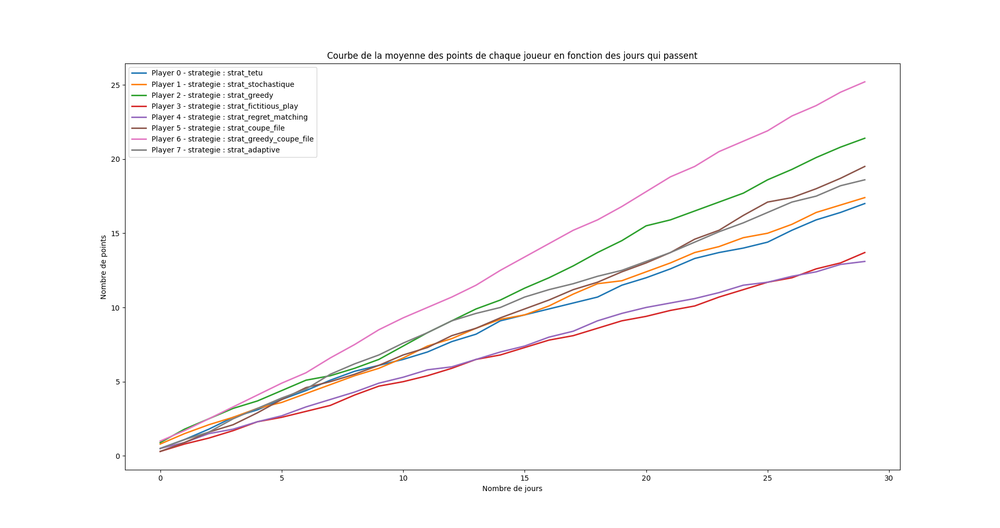

* Tests de la stratégie **Têtu** contre les autres :  
    - Têtu contre Stochastique :  
    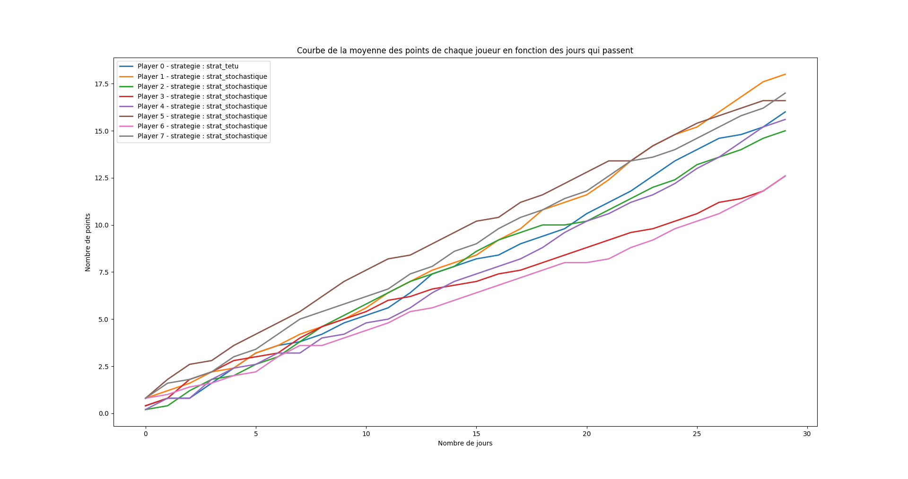
    
    - Têtu contre Greedy :  
    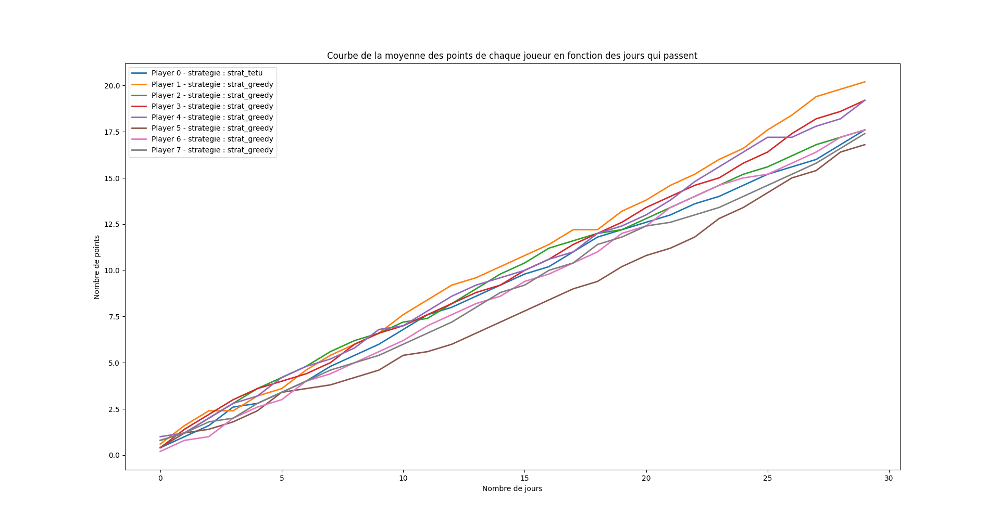
    
    - Têtu contre Fictitious-play :  
    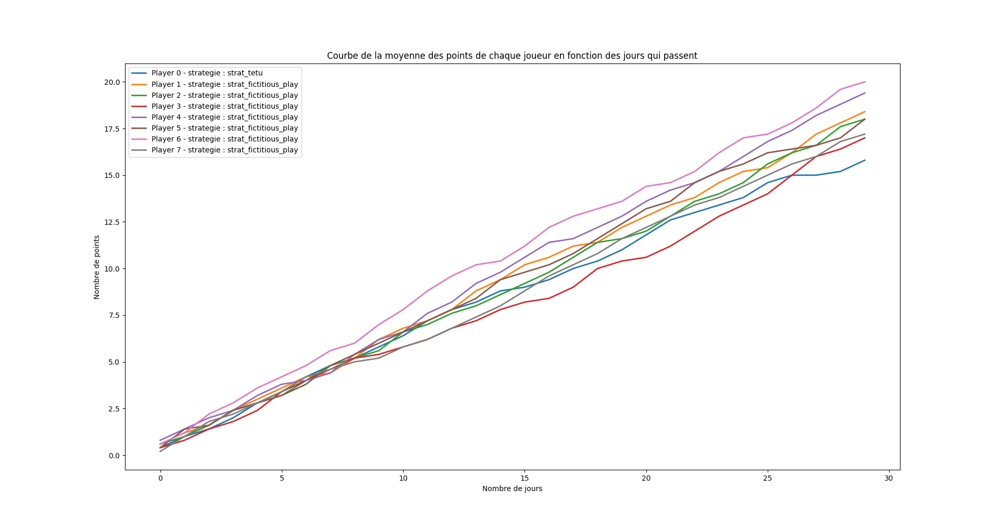
    
    - Têtu contre Regret-matching :  
    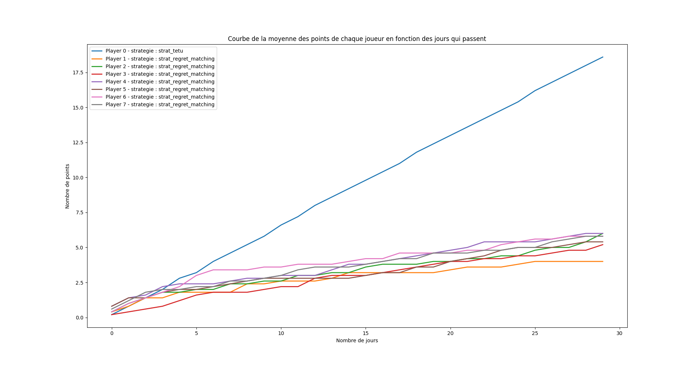
    
    - Têtu contre Coupe-file :  
    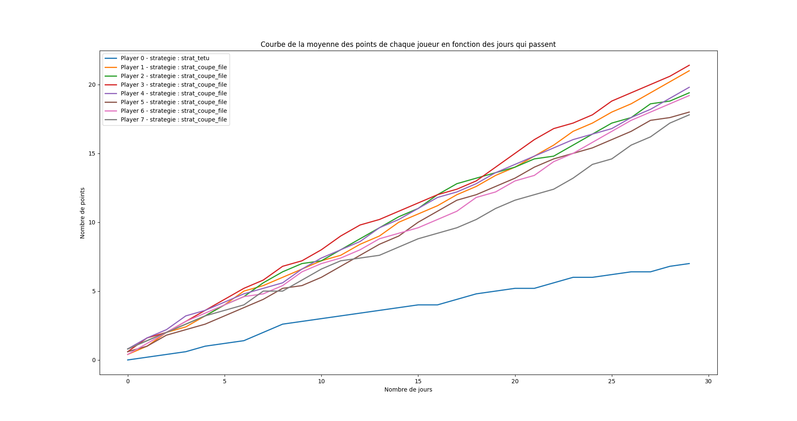
    
    - Têtu contre Greedy Coupe-file :  
    
    
    - Têtu contre Adaptative :  
    
    
    - Têtu contre Fictitious-play Coupe-file :  
    
    

* Tests de la stratégie **Stochastique** contre les autres :  
    - Stochastique contre Têtu :  
    
    
    - Stochastique contre Greedy :  
    
    
    - Stochastique contre Fictitious-play :  
    
    
    - Stochastique contre Regret-matching :  
    
    
    - Stochastique contre Coupe-file :  
    
    
    - Stochastique contre Greedy Coupe-file :  
    
    
    - Stochastique contre Adaptative :  
    
    
    - Stochastique contre Fictitious-play Coupe-file :  
    
        

* Tests de la stratégie **Greedy** contre les autres :  
    - Greedy contre Têtu :  
    
    
    - Greedy contre Stochastique :  
    
    
    - Greedy contre Fictitious-play :  
    
    
    - Greedy contre Regret-matching :  
    
    
    - Greedy contre Coupe-file :  
    
    
    - Greedy contre Greedy Coupe-file :  
    
    
    - Greedy contre Adaptative :  
    
    
    - Greedy contre Fictitious-play Coupe-file :  
    
        

* Tests de la stratégie **Fictitious-play** contre les autres :  
    - Fictitious-play contre Têtu :  
    
    
    - Fictitious-play contre Stochastique :  
    
    
    - Fictitious-play contre Greedy :  
    
    
    - Fictitious-play contre Regret-matching :  
    
    
    - Fictitious-play contre Coupe-file :  
    
    
    - Fictitious-play contre Greedy Coupe-file :  
    
    
    - Fictitious-play contre Adaptative :  
    
    
    - Fictitious-play contre Fictitious-play Coupe-file :  
    
  

* Tests de la stratégie **Regret-matching** contre les autres :  
    - Regret-matching contre Têtu :  
    
    
    - Regret-matching contre Stochastique :  
    
    
    - Regret-matching contre Greedy :  
    
    
    - Regret-matching contre Fictitious-play :  
    
    
    - Regret-matching contre Coupe-file :  
    
    
    - Regret-matching contre Greedy Coupe-file :  
    
    
    - Regret-matching contre Adaptative :  
    
    
    - Regret-matching contre Fictitious-play Coupe-file :  
    
          

* Tests de la stratégie **Coupe-file** contre les autres :  
    - Coupe-file contre Têtu :  
    
    
    - Coupe-file contre Stochastique :  
    
    
    - Coupe-file contre Greedy :  
    
    
    - Coupe-file contre Fictitious-play :  
    
    
    - Coupe-file contre Regret-matching :  
    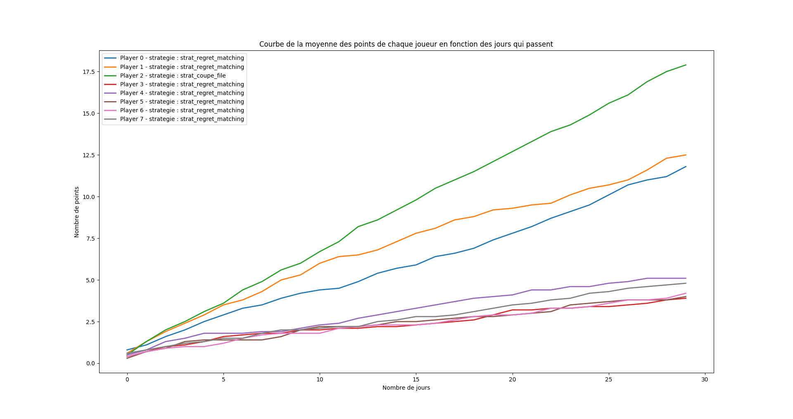
    
    - Coupe-file contre Greedy Coupe-file :  
    
    
    - Coupe-file contre Adaptative :  
    
    
    - Coupe-file contre Fictitious-play Coupe-file :  
    
              

* Tests de la stratégie **Greedy Coupe-file** contre les autres :  
    - Greedy Coupe-file contre Têtu :  
    
    
    - Greedy Coupe-file contre Stochastique :  
    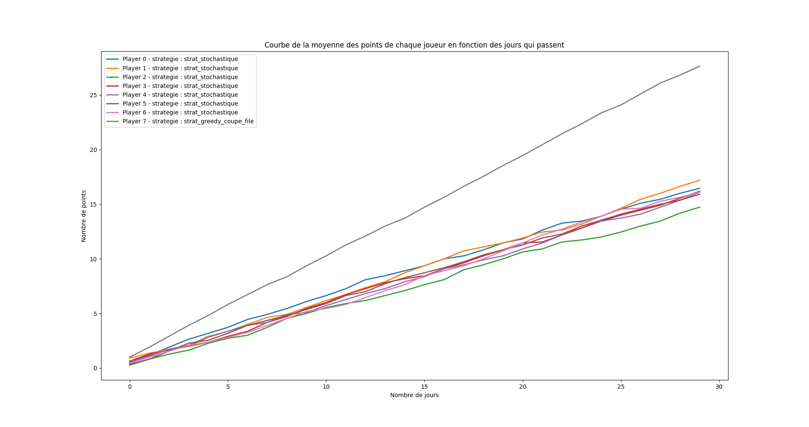
    
    - Greedy Coupe-file contre Greedy :  
    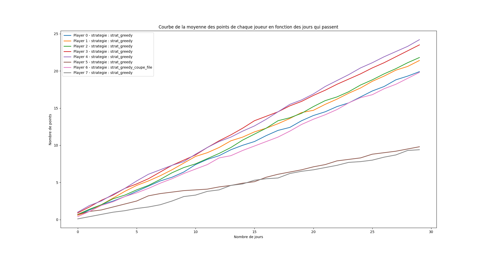
    
    - Greedy Coupe-file contre Fictitious-play :  
    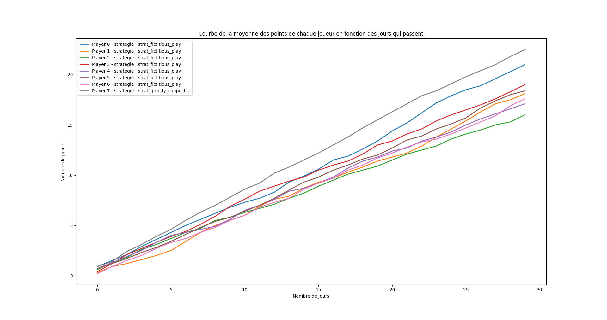
    
    - Greedy Coupe-file contre Regret-matching :  
    
    
    - Greedy Coupe-file contre Coupe-file :  
    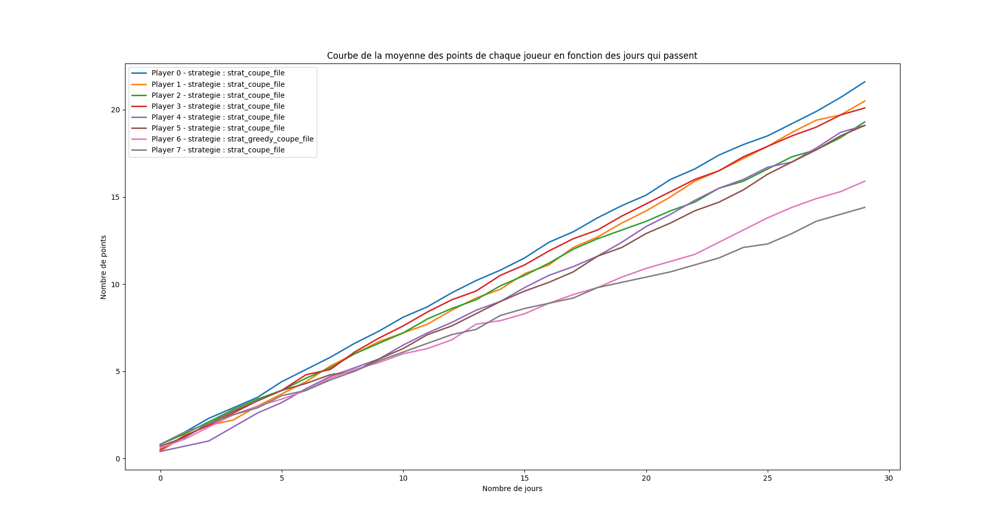
    
    - Greedy Coupe-file contre Adaptative :  
    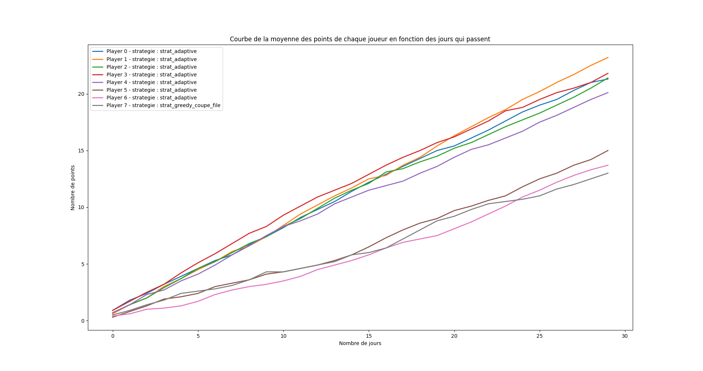
    
    - Greedy Coupe-file contre Fictitious-play Coupe-file :  
    
                  

* Tests de la stratégie **Adaptative** contre les autres :  
    - Adaptative contre Têtu :  
    
    
    - Adaptative contre Stochastique :  
    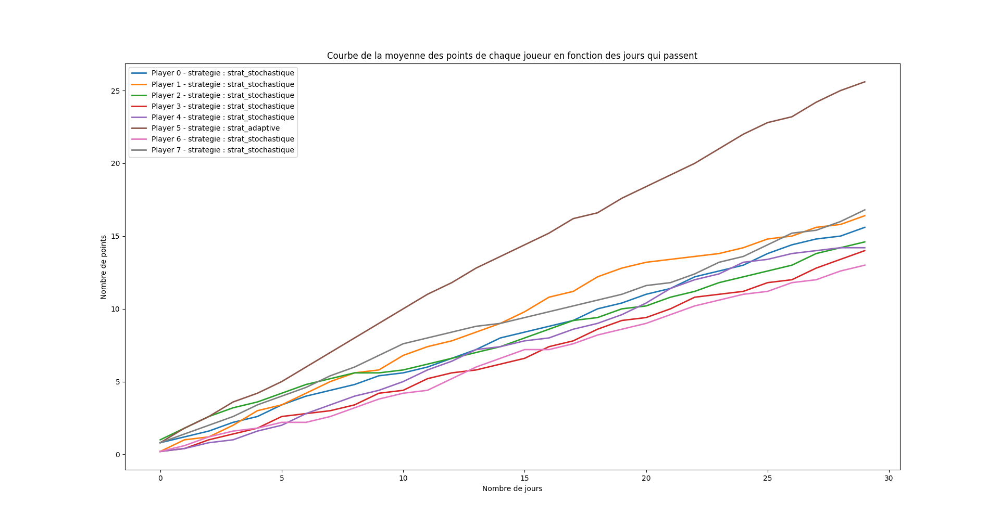
    
    - Adaptative contre Greedy :  
    
    
    - Adaptative contre Fictitious-play :  
    
    
    - Adaptative contre Regret-matching :  
    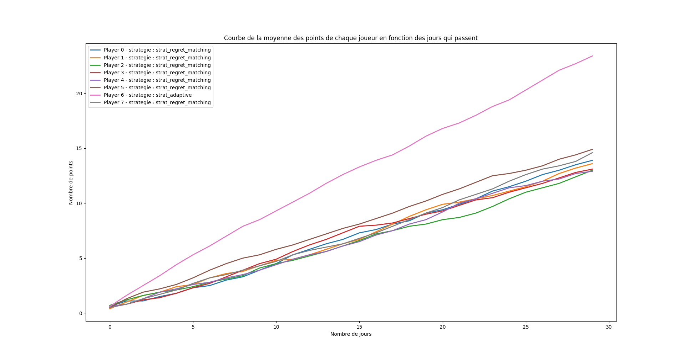
    
    - Adaptative contre Coupe-file :  
    
    
    - Adaptative contre Greedy Coupe-file :  
    
    
    - Adaptative contre Fictitious-play Coupe-file :  
    
                     

* Tests de la stratégie **Fictitious-play Coupe-file** contre les autres :  
    - Fictitious-play Coupe-file contre Têtu :  
    
    
    - Fictitious-play Coupe-file contre Stochastique :  
    
    
    - Fictitious-play Coupe-file contre Greedy :  
    
    
    - Fictitious-play Coupe-file contre Fictitious-play :  
    
    
    - Fictitious-play Coupe-file contre Regret-matching :  
    
    
    - Fictitious-play Coupe-file contre Coupe-file :  
    
    
    - Fictitious-play Coupe-file contre Greedy Coupe-file :  
    
    
    - Fictitious-play Coupe-file contre Adaptative :  
    